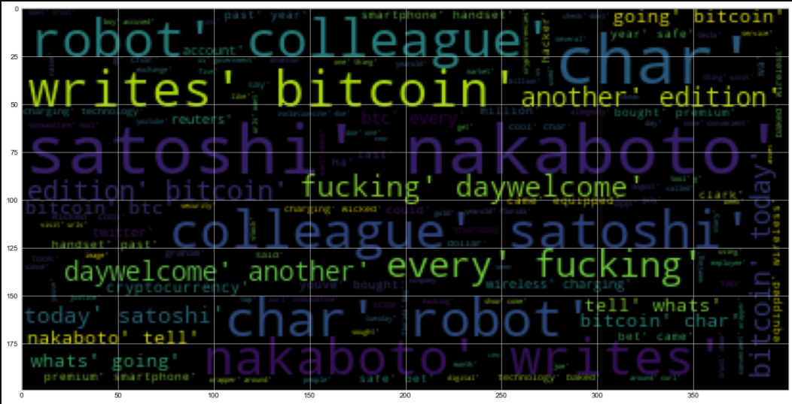
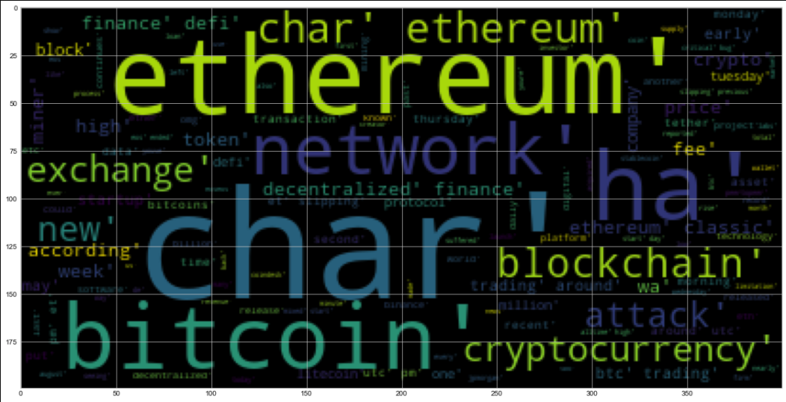

# Natural Language Processing and Crypto

This repo applies natural language processing to understand the sentiment in the latest news articles featuring Bitcoin and Ethereum. The fundamental NLP techniques have also been applied to better understand the other factors involved with the coin prices such as common words and phrases and, organizations and entities mentioned in the articles. This repo uses Sentiment Analysis, NLP, NGrams and Frequency Analysis, and Named Entity Recognition.

## Instructions

### 1 - Sentiment Analysis

The [newsapi](https://newsapi.org/) was used to pull the latest news articles for Bitcoin and Ethereum. There has been a DataFrame created  of sentiment scores for each coin.

Questions:
Q: Which coin had the highest mean positive score?

    A: Bitcoin had the highest mean positive score by 0.018053

Q: Which coin had the highest compound score?

    A: Bitcoin

Q. Which coin had the highest positive score?

    A: Bitcoin

---

### 2 - Natural Language Processing

In this section, we use NLTK and Python to tokenize text, find n-gram counts, and create word clouds for both coins. The top 10 words for each coin are as follows:

Bitcoin:
```
[('bitcoin', 80),
 ('satoshi', 44),
 ('nakaboto', 44),
 ('today', 24),
 ('every', 23),
 ('another', 23),
 ('edition', 23),
 ('tell', 23),
 ('going', 23),
 ('charsour', 22)]
 
```

Ethereum:
```
[('ethereum', 45),
 ('ha', 25),
 ('network', 20),
 ('blockchain', 17),
 ('bitcoin', 17),
 ('defi', 16),
 ('charsethereum', 15),
 ('cryptocurrency', 13),
 ('exchange', 13),
 ('trading', 12)]
 
```

Next, look at the ngrams and word frequency for each coin.

Bitcoin N-grams where N=2
```
[(('satoshi', 'nakaboto'), 44),
 (('charsour', 'robot'), 22),
 (('robot', 'colleague'), 22),
 (('colleague', 'satoshi'), 22),
 (('nakaboto', 'writes'), 22),
 (('writes', 'bitcoin'), 22),
 (('every', 'fucking'), 22),
 (('fucking', 'daywelcome'), 22),
 (('daywelcome', 'another'), 22),
 (('another', 'edition'), 22)]
```
Ethereum N-grams where N=2
```
[(('finance', 'defi'), 10),
 (('decentralized', 'finance'), 9),
 (('btc', 'trading'), 7),
 (('trading', 'around'), 7),
 (('ethereum', 'blockchain'), 6),
 (('ethereum', 'classic'), 6),
 (('around', 'utc'), 5),
 (('utc', 'pm'), 5),
 (('pm', 'et'), 5),
 (('et', 'slipping'), 5)]
```


#### Word Clouds





---

### 3 - Named Entity Recognition

Named Entity Recognition model for both coins and visualize the tags using SpaCy.


---

## Resources

[Vader Sentiment Analysis](http://www.nltk.org/howto/sentiment.html)

---

## Hints and Considerations

The free developer version of the News API limits the total monthly requests, so be careful not to exceed the free limits.

